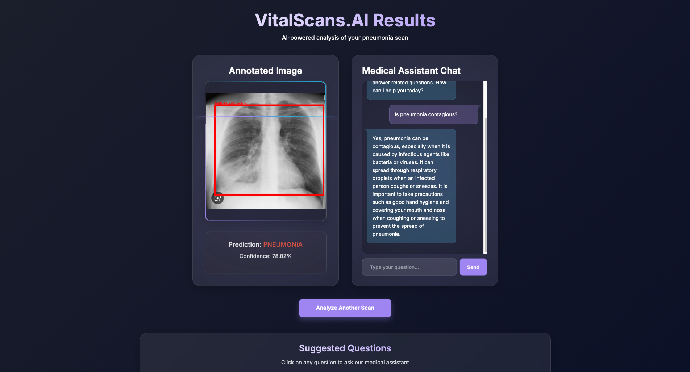

<!-- README.md -->

<h1 align="center" style="color: #4CAF50;"><strong>VitalScans.AI</strong></h1>

Empowering Early Diagnosis

  

VitalScans.AI revolutionizes the way we diagnose lung diseases like pneumonia, tuberculosis (TB), and more, along with MRI scans, by offering AI-powered image analysis at home. By enabling early diagnosis and providing detailed results that can be shared with doctors, this project bridges the gap between healthcare accessibility and effective medical care, reducing the need for multiple radiologist visits and saving precious time.

  

<!-- Screenshot Section -->
<h2 style="color: #f39c12; text-align: center; margin-top: 20px;">Screenshots</h2>

  <!-- Landing Page Screenshot (Same size as others) -->
  

  

    <!-- Pneumonia, TB, and Fracture Screenshots (Same size) -->
    
    
    
  

  <!-- FAQ Screenshot (Same size as others) -->
  

  

<h2 style="color: #f39c12; text-align: center; margin-top: 20px;">Concept and Need</h2>

 

Detecting lung diseases like pneumonia and TB early is critical for effective treatment. However, traditional diagnosis often requires multiple visits to a healthcare facility, which delays treatment and increases costs. Additionally, access to radiologists can be limited in remote areas, further exacerbating the issue.

 

<strong>VitalScans.AI</strong> offers a quick, AI-powered solution that allows users to scan X-rays and MRIs at home for an initial diagnosis. The results can then be shared with healthcare professionals, ensuring no symptoms are overlooked and providing a head start in the treatment process.

  

<h2 style="color: #f39c12; text-align: center; margin-top: 20px;">🌟 Key Features</h2>

 

<ul style="font-size: 1.1em; text-align: center;">
    <li><strong>Disease Detection:</strong></li>
    <ul>
        <li><strong>Pneumonia Diagnosis:</strong> Detects pneumonia in chest X-rays and provides confidence scores for predictions.</li>
        <li><strong>Tuberculosis Screening:</strong> Identifies TB-related abnormalities using sophisticated image analysis techniques.</li>
        <li><strong>Bone Fracture Identification:</strong> Examines MRI and X-ray scans for fractures and offers annotated insights.</li>
    </ul>
     
    <li><strong>Technical Features:</strong></li>
    <ul>
        <li><strong>AI-Powered Annotation:</strong> Provides visual overlays to highlight abnormalities in uploaded scans.</li>
        <li><strong>Interactive Q&A Mode:</strong> Users can interact with an AI-powered system for a deeper understanding of their results.</li>
        <li><strong>Risk Assessment Reports:</strong> Summarizes findings with severity levels and actionable recommendations for users.</li>
    </ul>
     
    <li><strong>Accessibility:</strong></li>
    <ul>
        <li><strong>Remote Diagnostics:</strong> Designed to offer accurate results even in areas lacking advanced medical infrastructure.</li>
        <li><strong>Multilingual Support:</strong> Supports various languages for inclusivity and ease of use.</li>
    </ul>
</ul>

  

<h2 style="color: #f39c12; text-align: center; margin-top: 20px;">⚙️ How It Works</h2>

 

<ul style="font-size: 1.1em; text-align: center;">
    <li><strong>Upload Scan:</strong> Users upload X-ray or MRI images via a secure web interface.</li>
    <li><strong>Preprocessing:</strong> The uploaded images are preprocessed using OpenCV to standardize their dimensions and enhance quality.</li>
    <li><strong>AI Inference:</strong> VitalScans.AI employs deep learning models fine-tuned on large medical datasets to analyze the scans.</li>
    <li><strong>Results Generation:</strong> The platform generates a detailed report, including confidence scores, annotations, and diagnostic summaries.</li>
    <li><strong>Interactive Feedback:</strong> Users can query the system for further explanations or export the reports for medical consultations.</li>
</ul>

  

<h2 style="color: #f39c12; text-align: center; margin-top: 20px;">📊 Datasets and Model Citations</h2>

 

The following datasets were used for training and fine-tuning VitalScans.AI models:

 

<pre><code>
Pneumonia Detection Model:
@misc{
  pneumonia-itjkr_dataset,
  title = {Pneumonia Dataset},
  type = {Open Source Dataset},
  author = {Annie},
  howpublished = {\url{https://universe.roboflow.com/annie-rmqdv/pneumonia-itjkr}},
  year = {2023},
  month = {Nov},
  note = {visited on 2024-11-20},
}

Tuberculosis Detection Model:
@misc{
  tb-detection-227v0_dataset,
  title = {TB Detection Dataset},
  type = {Open Source Dataset},
  author = {KBS},
  howpublished = {\url{https://universe.roboflow.com/kbs-ymeyd/tb-detection-227v0}},
  year = {2023},
  month = {May},
  note = {visited on 2024-11-20},
}

Fracture Detection Model:
@misc{
  fracture-ov5p1_dataset,
  title = {Fracture Dataset},
  type = {Open Source Dataset},
  author = {Landy},
  howpublished = {\url{https://universe.roboflow.com/landy-aw2jb/fracture-ov5p1}},
  year = {2024},
  month = {Apr},
  note = {visited on 2024-11-20},
}
</code></pre>

  

<h2 style="color: #f39c12; text-align: center; margin-top: 20px;">🌐 Potential Use Cases</h2>

 

<ul style="font-size: 1.1em; text-align: center;">
    <li><strong>Rural Healthcare:</strong> Brings diagnostic capabilities to underserved regions, enabling faster and more accurate healthcare access.</li>
    <li><strong>Triage Tool:</strong> Assists medical facilities in prioritizing cases based on the severity detected by AI.</li>
    <li><strong>Medical Education:</strong> Provides a tool for students and professionals to practice diagnostic skills and learn from AI-driven insights.</li>
    <li><strong>Remote Consultations:</strong> Facilitates telemedicine by offering a quick preliminary diagnosis for doctors to review.</li>
</ul>

  

<h2 style="color: #f39c12; text-align: center; margin-top: 20px;">Contributing</h2>

 

We welcome contributions to improve VitalScans.AI! Fork the repository, make improvements, and submit a pull request.

